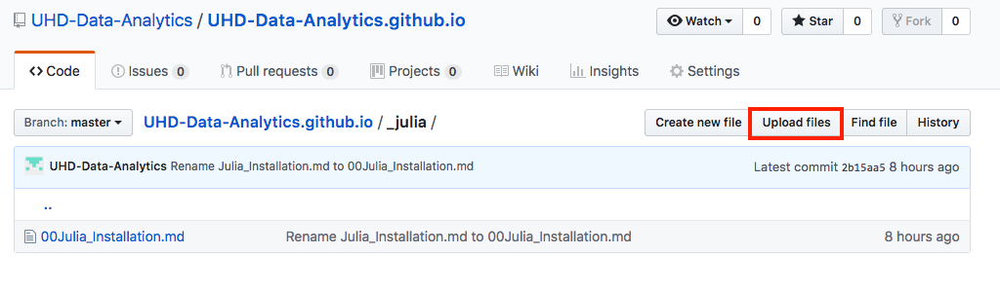
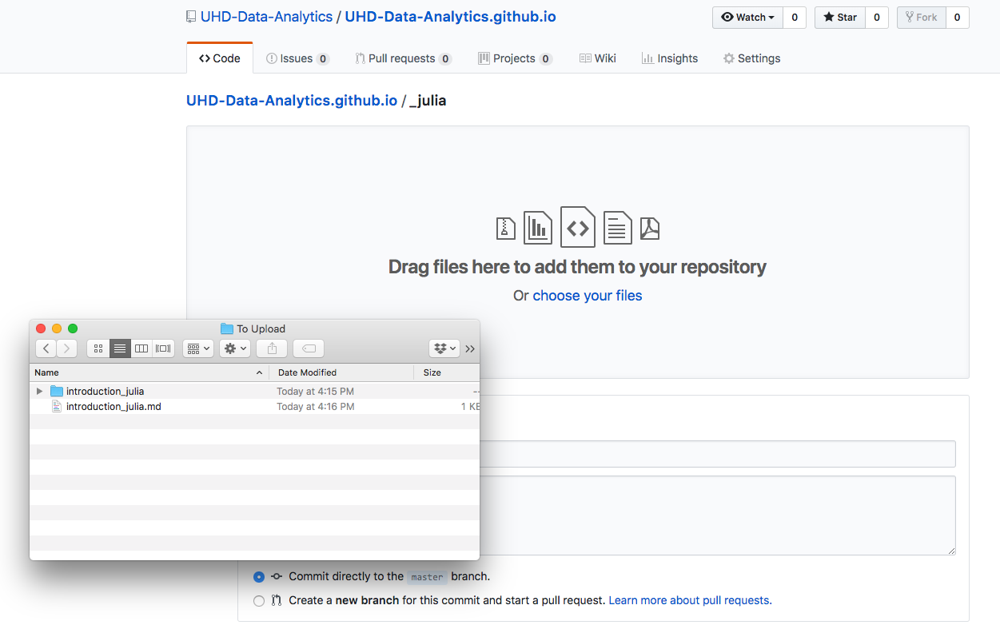

# How to upload documents to this website

* * *

To determine how to export a .rmd or a notebook to a markdown file, click the Contribute page on the right.

Once you have your markdown file ready, you can navigate to the folder that you want to add files to. In this example, we'll add a Julia page:

After you click upload file, you can then drag and drop the files you wish onto the upload box:

Then scroll down to click commit changes. You can add notes about the upload itself so it can be added to the changelog of the folder.

Once you get back to the original page and see the files uploaded, you might need to wait a minute so that github can rebuild the pages.
However, once this is done, you should have the fully uploaded page available in the section you uploaded it to.
