# How to contribute to this website:

* * *

You are free to to request the website holder to add your own content to this site. Please follow these instructions so your content will meet the requirements to post correctly:

### Exporting from jupyter or Rstudio

To export from jupyter, you can just select the download as markdown option under File:

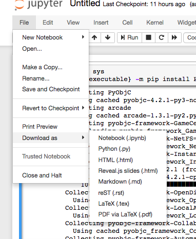

To knit your .rmd file, just make sure you have the front matter have:
```
---
output: md_document
---
```

For your page itself, make sure the exported markdown has the following front matter at the top of the page like so:


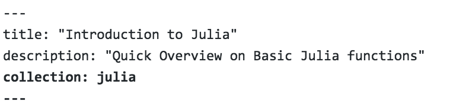

the title, description, and collection are all VERY IMPORTANT so that the page can pick up the contents properly and add links to the page.

It is also suggested to check your code outputs, and potentially wrap them in the triple accepts and then add the language it's written in like this:

````
```r
# here is some r code.
```
````

All of your image outputs should be in a folder labeled the same as your markdown file (try not to use any spaces for either).

Then you can relabel the markdown embedded images like so:

```

```

This way the `.` will pick up the folder automatically if it's labeled the same as the markdown file.

Now with a github account you can fork the website to your own github:

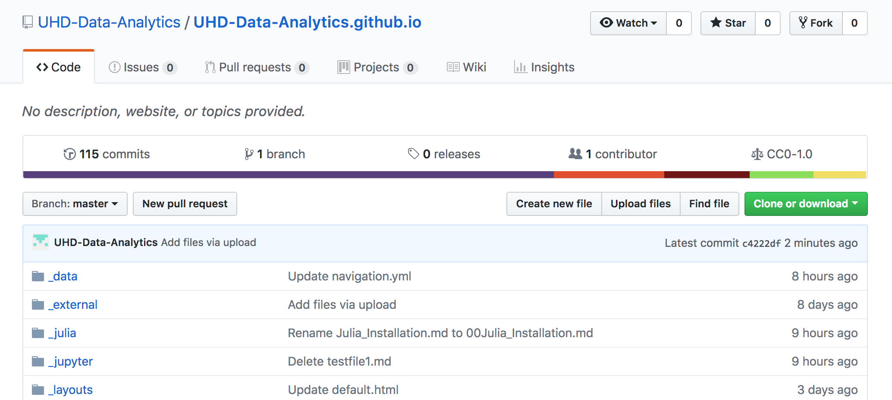

Then you can navigate to the folder you want to add your content, and click upload file:

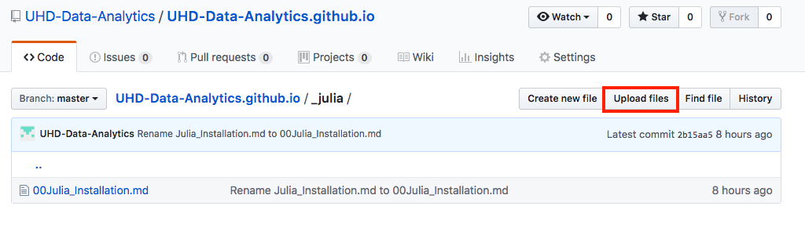

and then drag the files into the box and commit the changes to your local forked version of the website

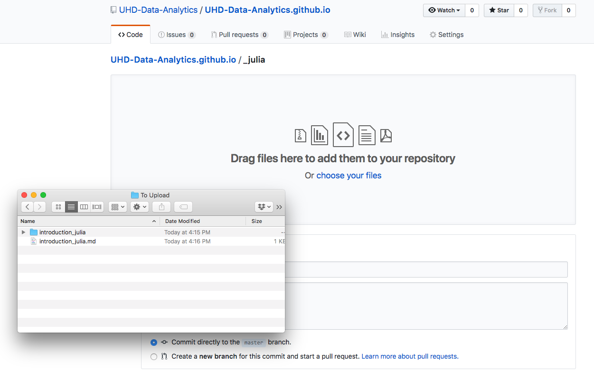

Now you are ready to make a pull request. First you click the pull request button on the left here:

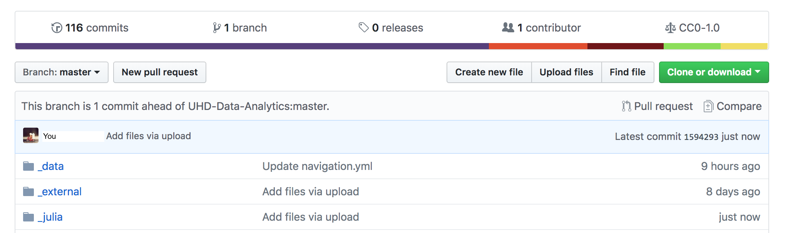

Then we can make sure it's able to merge and then create the pull request:

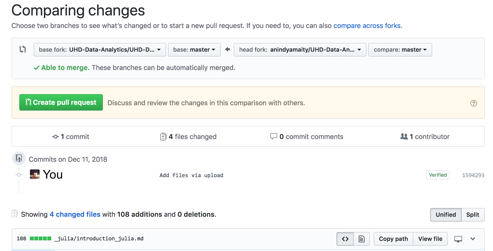

Add some comments, submit, and now the pull request is active!

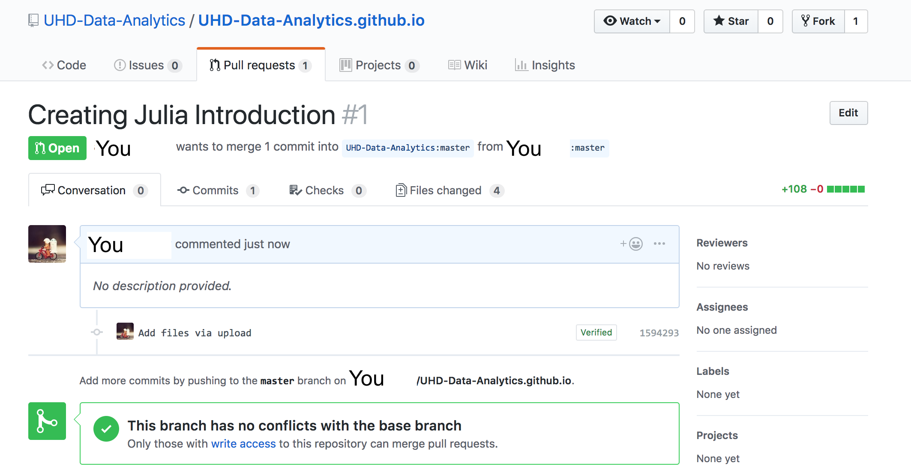


### Accepting a pull request

The site master can now check your pull request, by clicking on the pull request title:

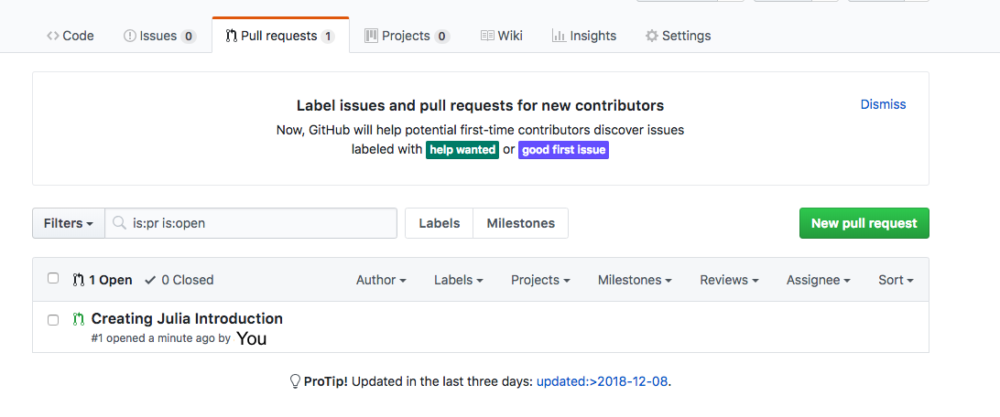

Check to see any conflicts, and if they feel comfortable with the content, they can merge the pull request:

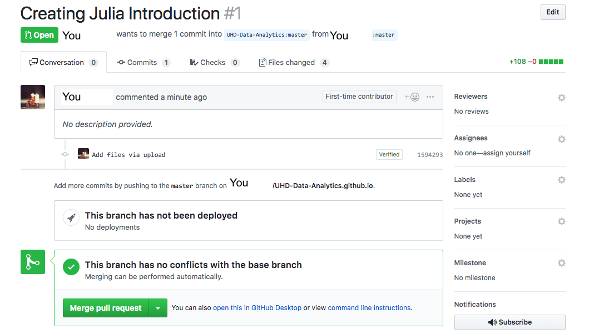

And a full merged request looks like this:

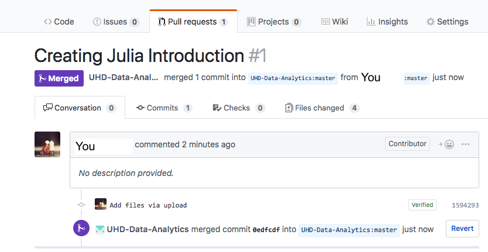


If your front matter was displayed correctly, your content will be added as a link to the site!
